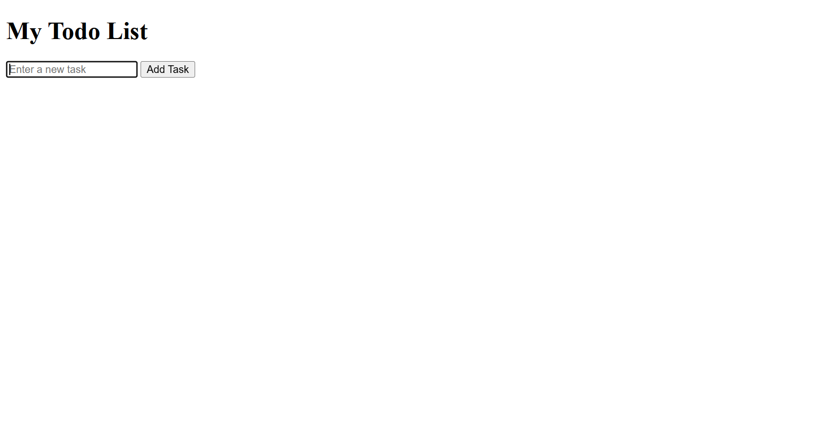
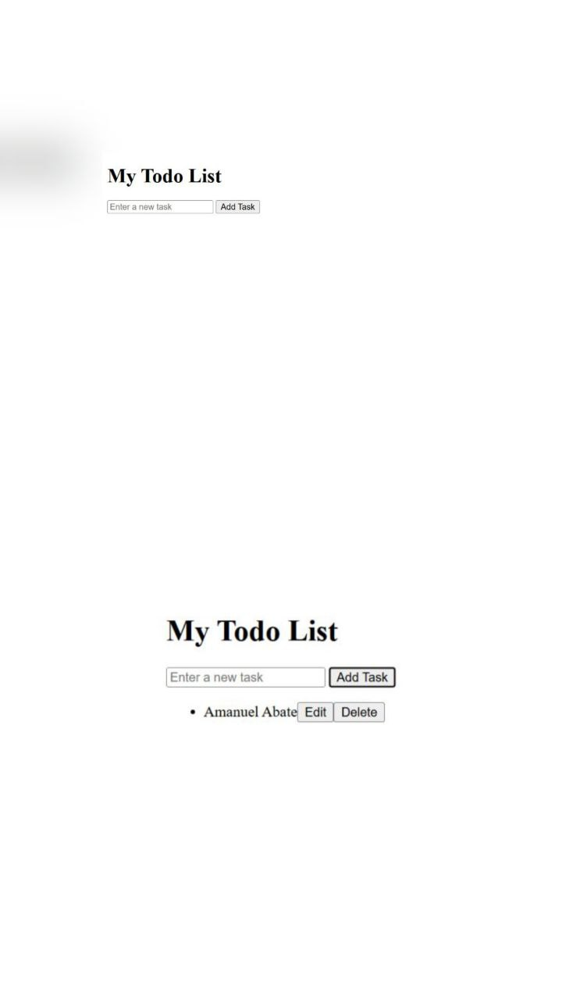
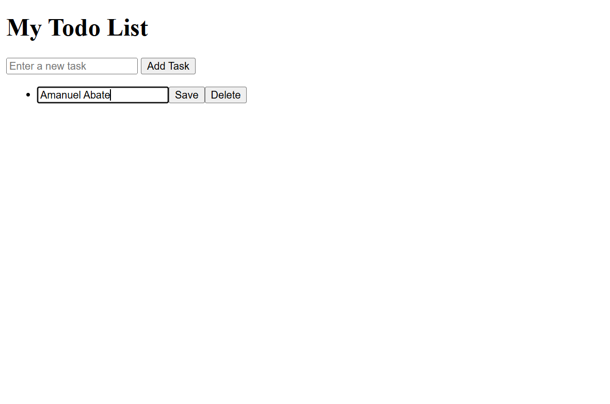
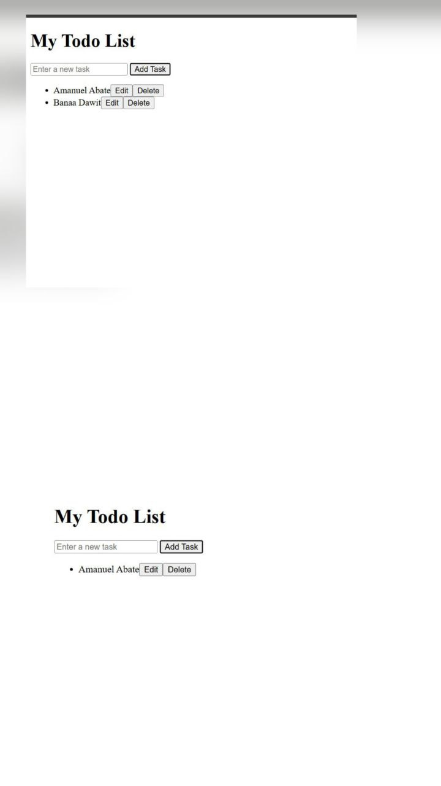

# ✅ Simple Todo List App (TypeScript)

This is a simple Todo List application built with **TypeScript**.

### 🎯 Features
- Add tasks
- Edit tasks
- Delete tasks
- DOM manipulation with TypeScript

---

## 📂 Project Structure
index.html
todo.ts        # TypeScript logic
todo.js        # Compiled JavaScript
tsconfig.json
README.md

🛠️ Technologies Used

    TypeScript

    HTML

    JavaScript (compiled from TS)

****How to Run the Project******

1️ Install TypeScript (if not installed)
npm install -g typescript

2️ Compile TypeScript File

Inside the project folder, run:

tsc todo.ts

This will generate todo.js.

3️ Open the App

Simply open index.html in any web browser:

Double-click index.html, or

Right-click → “Open With Browser”

## Screenshots
### 🏠 Main Page
This is the home page of the Todo List app where users can see the task input field and existing tasks.

### ➕ Add Task
This shows the process of adding a new task to the list.

### 📝 Edit Task
Here, the user is editing a task directly within the list using the inline input field.

### ❌ Delete Task
This screenshot shows the user deleting a task by clicking the "Delete" button.

## Author
Created by Amanuel Abate

